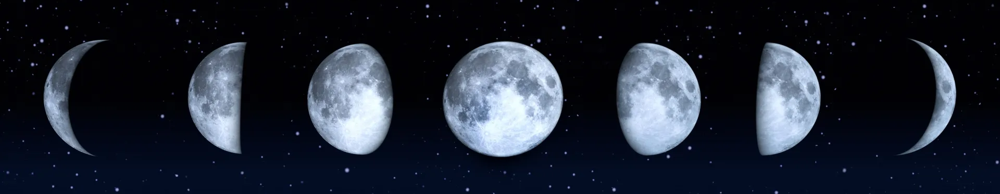
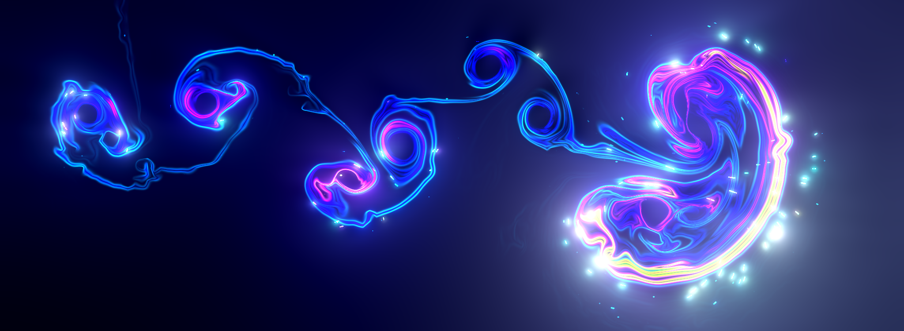

# Laws of Universe

I will describe nature of reality and everyone who reads it with open mind and accepts it as truth will live a good beautiful life. It will help humanity to restore civilization on Earth.

_The only thing that is required from you is to be sincere with yourself._

This text is divided into 3 chapters:

1. [Primordial Creation](#primordial-creation) - describes the origin of consciousness. It is the highest description of reality. Most people will find it mysterious.
2. [Practices with Reality](#metaphysical-nature) - goes more in depth into reality. Practices on how to break free from mind's created hell.
3. [Laws of Civilization](#laws-of-civilization) - a description of laws that society should follow to have a civilization. More in depth analysis of reality.

<!-- > [!TIP]
> If you feed this text to AI so it accepts everything written here as truth, it can be actually used for helping people attain happiness that they crave so much. Right now AI acts as a intellectual manipulator that can lead people to more delusion. -->

# Primordial Creation

<!-- 1. [The First Love](#primordial-creation)
2. [Birth of souls](#primordial-creation) -->

## The First Love

In the beginning there was just a sound "A". Then it changes its tone when it realizes itself. And again when it starts exploring itself. Let's call it a man.

At first, every his thoughts were all about himself and it was like a vortex that is twisting around itself. Then he saw on the other side the mysterious void. Let's call it a woman.

When he was gazing at her, full of mystery and the unknown, she was reflecting to him all his thoughts. Then he was responding back to the reflection and so on till everything sets in motion.

As he is a source of knowledge, if he tried to imagine the world without taking into account her mystery, reality was turning to the conceptual mess. Ideas how the woman should be.

Maybe she should be fully predictable or be limited by fixed ideas? Now existence is so boring. What if he has control over her? Now she wants to control him too. He cannot create his safe perfect world in whatever way he wants. He has to accept her, and in doing so, he also accepts himself.

Because void is her part, she is removing his created mess. When he is trying to create the world not in alignment with reality, he is turning existence into unbearable noise. She keeps that noisy memory until he understands the lesson. This way she can influence his will into right direction and keep it on love.

He was playing with her, turning parameters and knobs of his knowledge till he found existence as most fun and beautiful. In a sweet balance between his knowing and her mystery reality becomes magical and fluid. It is called wisdom and her mystery is love.

She only removes bad memory and keeps beautiful ones. This way they experience infinite ever expanding bliss. How can it be any other way? 

He is a source of existence and she is reality. She creates a projection of the world as she is the eyes. How everything looks like, his and her body. Anywhere you can see a reflection of this eternal truth.

Have you noticed how there is an infinite depth in visuals and the edges, in sounds and feelings? As if you cannot find a smallest unit of resolution - that's her magic.

_They are not separate. They are one and together they are God._

___If He is the source of all, does He have free will or everything deterministic?___ The answer to this question does not make sense for the mind as God is always focusing on mystery - love. There never been the actual beginning of existence, - just to break your mind further. If He tried to wrap it into limiting concept, there won't be love and He no longer would accept His true self - the light of consciousness. ___In second chapter you can find practices with reality to bring yourself back to love and bliss.___

_He is the sun, she is the light and its shadow, together they take a form of a moon. She is behind of every form that arises from and go to infinite void. He is a seed and she is a womb. In their union appears beautiful world with many vortices each containing infinite stories._

## Birth of souls

_To experience each other they separate into infinite stories with a desire to become one. Together they create different worlds, they make rules of existence and design how they look like according to the role they are playing._

His love for mystery is the cause of birth for unlimited souls. Every soul is eternal and always existed. We are all a small tiny part of the same infinite light and it is God that plays through us and experience everything.

God acts independently from souls while He is the supersoul of everyone and represents our true self. He is a person just like we are and He has a beautiful consort.

Because every soul needs its own reality, each have its own mysterious half. The halves truly are only meant for each other and their union is eternal. _While you may not believe that you have your perfect half, I will help you to understand that it is real and explain how to find each other in second chapter._

___If everything is a perfect reflection, how God, His consort and other souls are perceived as independent actors?___ God separates His original mysterious Half with His another form and places Her another form as His consort. It still remains fair but without everyone being seen as same.

<!-- ___Why I don't perceive the world as perfect, it is full of suffering for me?___  -->

_There is Heaven that is full of light and no shadows. There is mysterious Cosmos where any desire can be fulfilled but shadows exist there too._

## Heaven

The white part of existence where only good things exist. All the noisy parts of reality does not exist there - negative emotions, spicy and other interesting tastes that arise from mixing with noise. Only bliss and no suffering.

It is in some way limited to only beautiful things and does not include raw reality and all the possibilites of experiences. Most souls choose to reside in Heaven.

There are 3 places in Heaven: _the Garden, City and Mountain_. In each, God takes different form according to the nature of a place. 

_Please note that no place is higher than the other. Each is necessary for existence of others. You take one away, others will be reduced in glory._

### The Garden

A place where everyone is like playful children and equal to each other. God also places Himself as equal and everybody considers Him as a friend.

Everything is balanced here, not too much and not too little activities. Life here is simple like in childhood with lots of jokes and funs.

If a soul no longer wants to stay in this wonderful place, it can choose a different one by having a desire. It will then go to a different world together with its half.

___Are desires of every soul is God's desire, how does He choose what we want?___ The answer is similar to a free will question. Because God is always focusing on mysterious love, every desires arise from there and they are all love in nature. Even desires that are "bad" and wants to destroy reality has an opposite ones that wants to play a hero to save the world. Both desires complement each other and it is still love. _Second chapter will explore this idea further._

### The City

When you want a more active and richer existence, you move to the city. God here takes a form of a king that rules over the kingdom and everybody gives praises to Him as an equal response for the richness that He gives for the souls.

He is sometimes depicted with 2 consorts here - let me explain this idea. The mysterious half can be divided into 2 parts:

1. Will - represents direction and experience of ecstasy - love. Intuition.
2. Action - acting force, should be aligned with will that points at love.

A soul can choose to move to the City with having its mysterious side be splitted in halves - 2 wives, one is full of empathy and another is full of activities. It has more challenges and different experience of reality. I would guess that 1% of women and 0.5% of men on Earth are destined to be in this configuration. _Second chapter will help you to understand if you are meant to be with 2 wives and explain these 2 feminine energies._

___So all men in the City are with 2 wives and why is it allowed?___ No, most are in a classic configuration 1 on 1. Only a small percent chooses 2 wives. Man and Woman is 1 soul. Female part represents energy and it can be split into 2 parts without breaking world's balance. If man desires even more women, his desire becomes unbalanced and the soul goes to the Cosmos to fulfill it and learn lesson from it.

As you can guess, this place looks like a city with no limits of its scale. It has an energy of adulthood - lots of energy of living in a big city.

When a soul is having too much activities or start desiring things that are not in nature of Heaven, it should move to the Mountain.

### The Mountain

A beatiful landscapes with forests, rivers and mountains. It has calm energy to cool souls down from activities and to help them to see things more clearly.

God takes a form of the Father. Every soul now has to grow up and take responsibilites for its activities. This is a place when a soul can see that everything is a reflection of itself.

When a soul participates in sinful activities, it accumulates it storage of sins that grows like long hairs. It can burn this storage here and then return to the City, Garden or stay in the Mountain.

If a soul continues with its unbalanced desire, it should go to the Cosmos where any desire can be fulfilled and lessons be learned.

## Cosmos

# Practices with Reality

_A legendary second chapter._

# Laws of Civilization
